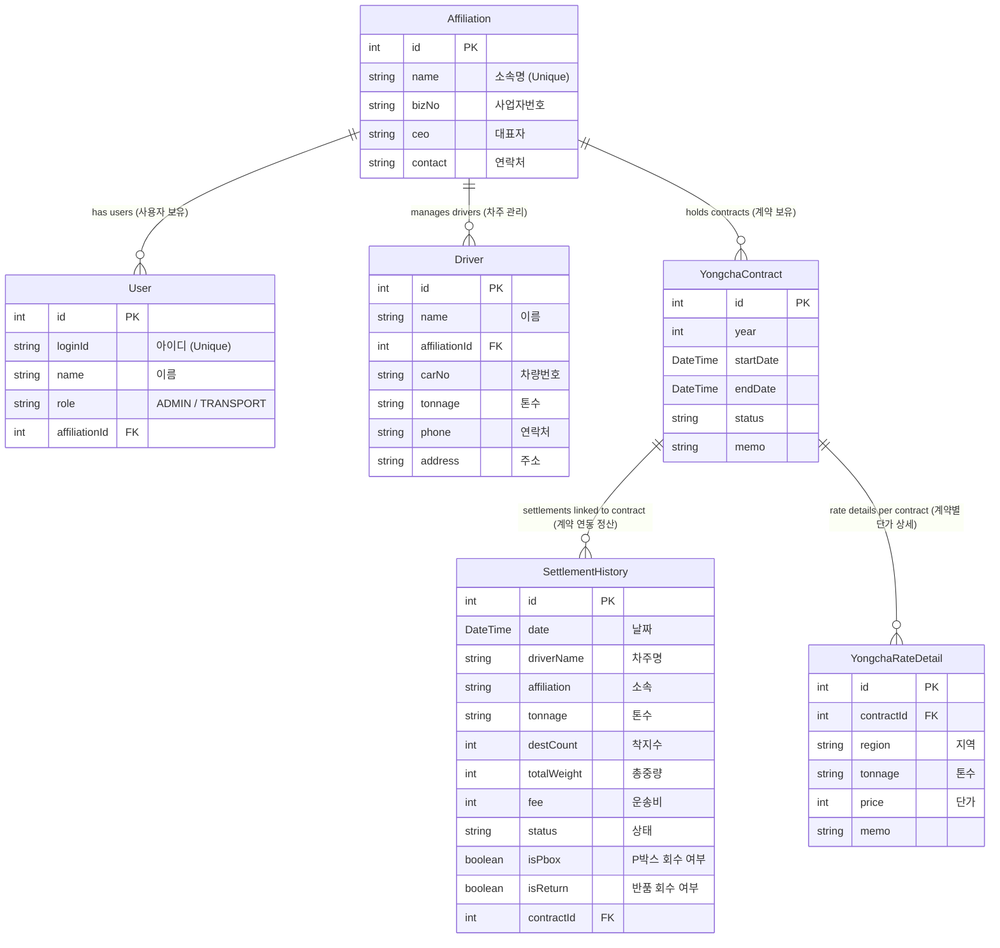

# Prisma Schema Visualization

prisma 스키마의 시각적 표현입니다.

## 핵심 비즈니스 로직 (neon.prisma & local.prisma)

운송 정산(Transportation Settlements), 계약(Contracts), 차주(Drivers), 소속(Affiliations), 사용자(Users) 등의 새로운 기능을 관리합니다.



### 테이블 설명

- **Affiliation (운송사)**: 운송 회사를 나타냅니다.
- **User (사용자)**: 운송사(또는 관리자)에 소속된 시스템 사용자입니다.
- **Driver (기사)**: 운송사에서 관리하는 차주(기사)입니다.
- **YongchaContract (용차 계약)**: 특정 기간(연도) 동안의 단가 및 조건을 정의하는 계약입니다.
- **YongchaRateDetail (용차 단가 상세)**: 계약 내에서 지역/톤수별 구체적인 단가입니다.
- **SettlementHistory (정산 내역)**: 개별 운송 건에 대한 정산 내역이며, 단가 계산을 위해 계약과 연결됩니다.

---

## 기존 / 배차 시스템 (schema.prisma)

이 스키마는 기존 MySQL 데이터베이스에 연결되며, 배차 로그, 메시지(MMS/SMS), 주문 데이터 등 많은 테이블을 포함합니다.

**주요 테이블 (간략 보기):**

- **t_balju**: 발주(주문) 정보.
- **t_car**: 차량 정보.
- **t_cust**: 거래처(고객) 정보.
- **mms*log*\*** & **sc*log*\***: 월별 메시지 발송 로그.

_(이 레거시 스키마는 테이블 수가 많고 Prisma 상에서 명시적인 외래 키 관계가 설정되어 있지 않아, 명확성을 위해 전체 시각화 다이어그램은 생략했습니다.)_

## 데이터를 시각적으로 확인하는 방법

Prisma는 데이터를 시각적으로 확인하고 편집할 수 있는 **Prisma Studio**라는 내장 GUI 도구를 제공합니다.

터미널에서 다음 명령어를 실행하여 사용할 수 있습니다:

```bash
npx prisma studio --schema=prisma/neon.prisma
# 또는
npx prisma studio --schema=prisma/local.prisma
```

이 명령어를 실행하면 웹 브라우저(통상 http://localhost:5555)가 열리며, 모든 테이블과 데이터 행을 시각적으로 탐색할 수 있습니다.
